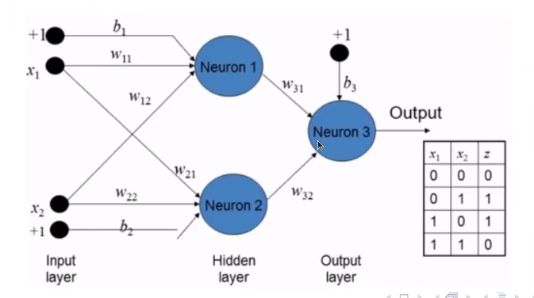

<link rel="stylesheet" href="github-markdown.css">
 
# Aula 1 - Logistics

# Aula 2 Introdução

Treinamento: tunning dos parametros utiliando algoritmos de otimização para minimizar função de perdas.

Generalização: Similarmente a navalha de occam, utilizar hipoteses e funções suficientemente complexas, ou o mais simples possivel que represente os dados.

O algoritmo de aprendizado procura por uma boa função no grupo de hipoteses ( seja otimização ou heuristica)

# Perceptron

Simplificação de neurônio:

Multipas entradas e uma saida
Cada entrada tem um peso que é multiplicado pelas entradas
O neuronio faz a soma ponderada das entradas de acordo com os pesos para determinar a saida de acordo com uma funcao de ativacao

# Aula 3 Aprendizado supervisionado

Perceptron e' bom apenas para problemas lineares.

PAC - Probaly aproximate correct

 Consider a bin with read and green marbles
- p[picking a red marble]
- p[picking a green marble]

$\mu$ = probability of red marble. Unknow values
but we pick N marbles independyly

the fraction of red marbles is $\nu$

 does $\nu$ says anything abouth $\mu$?
 
 No! - sample can dont represent universe set
 
Yes - sample frequency $\nu$ is probabily close to bin frequency $\mu$.

Possible vs probable paradox

Em uma grande amostragem $\nu$ e' aproximadamente aproximada a $\mu$
dentro de erro $\episilon$

Formalmente:  
$$ p[evento~ruim] = p[| \nu - \mu | \gt \epsilon ] \leq e^{-\epsilon^22N} $$  
  quao pequeno pode ser.
(Desigualdade de Hoeffding's)

Portanto a proposicao $\mu=\nu$ e' P.A.C.

Limite e' frouxao, nao faz tanto sentido na pratica, mas formaliza a relcao de amostragem e tolerancia. Valido para qualquer N e $\epsilon$.

- Tolerancia pequena implica em amostragem grande
- Amsotragem pequena implica em tolerancia grande  
  
Dada hipotese h:
- Erro empirico $\nu$ $E_{in}(h)$ : Se for baixo, **pode ser uma hipotese boa**  
- Erro esperado $\mu$ $E_{out}(h)$: Se for baixo, **é uma hipotese boa**  
p[| $E_{in}(h)$ - $E_{out}(h)$ | \gt \epsilon ] \leq e^{-\epsilon^22N} $$  
 
 
[$E_{in}(h)$]:

---

## principios de inducao

- Nãoo é possivel minimizar o error de teste (erro empirico)]  
o metodo empregado para substituir o erro espersdo por outra quantidade que podemo minimizar pe o princioio da inducao:  
-  minimizando erro impirico no conjunto de teste
- usar termo de regulrização para penalizar modelos complexos.  

## Rede neural de uma camada

perceptron pra problemasd linearmente sepaeaveis 

## regressão logistica

- perceptron com sigmoid na saida: estimativa de p(y=1|X). Chamado de classidicador de regressão logistica.
- tbm nao é linearmente separavel com uma camada so
- se maior que 0.5 prediz classe 1. Caso contrário classe 0

- $f(X)=\sigma(W^TX+b)$ 
- 
 
- $W \in R^d e b é o viés escalar$
- Pesos podem não condizente com a realidade, embora a saida do modelo tenha acertado
- Função de perda: squared error loss: $L(W)=\frac{1}{2} \Sigma(\sigma(W^TX^{(i)})-y^{(i)})^2$

- 
derivada da sigmoid eh um multiplo dela mesma
- 

Treinamento
- 
plotar a funão de perda por iteração para observar a evolução

## regressão logistica (RNN de uma camada) vs perceptron

- perceptron encontra pesos que estão proximos e um bom conjunto de pesos: o cnjt de pesos formando a fronteira que sepaea os pontos
- RNN encontra os pesos de forma que as saidas previstas sempre chegam proximos da saida desejada. Funciona para problemas não convexos.

necessita de feature scaling algoritmos baseados em gradient descending
x = xi - min(xi) / max(xi) - min(xi)

 
scalling vs normalization: as vezes é a msm coisa
- 

##  gradient decending vs sgd

Entradas funcionam como restrições na busca para o sgd
gradient descend atualiza pouco e itera mt masd direção é certeira

estocastico gasta menos epocas
sgd varia mt a direção
varia mt a direção

é interessante taxa de aprendizado variavel a medida dq amostras de testes aumentam

---
# Aula 7

## batch gradient descend
- usar todos exemplos em cada itetação
- SGD usa um exemplo por iteação
- minibatch sgd: usar b exemplos para cada iteração.
- pode ser até mais raído que sgd  
batch é o meio termo

## Regulaeização

- Não faz apenar minimização de erro empirico mas tbm estrutural penalizando aumento de capacidade, assim evitando overfitting
- Não interessante valores altos dos pesos, pois deixa mt sensivel as entradas. Entradas similares podem levar a saidas mt diferentesregularização prevem isso.

- Paradas antecipadas com validação cruzada: quano conjunto de testes para de melhorar realizar parada
- Com mais de uma camada consegure resolver problemas não linearmente separáveis tipo xor

## Rede neural de 2 camadas

- camada de entrada com dois neuronios
- uma camada oculta com 2 camadas
- camada de saida com um neuronio
- Capacidade de mudar a representaççao da entrada por meio da primeira camada
- Modela naõ linearidades complexas
- 1 camada modela apenar hiperplano linear
- 2 camadas nao aproximadores universais, dado numero invfinito de unidades ocultas
- 3 camadas podem fazer o mesmo e com menos nós, menos propricio a overfiting e masi rapido
  

---

# Aula 8

- Camadas ocultas pode m ser vistas como caracteristicas combinando as entradas de multiplas regressões logigisticas

## Backpropagation:

Objetivo é atualizar todos os pesos

## algoritmo
1. Inicializar os pesos ( seja por heuristicas ou aleatorios)  
2. Para cada exemplo $(x_i, y_i)$  
3.   1. Calcular o erro (forward pass/ passagem direta)
4.   2. Calcular gradientes locais para cada nó
5.   3. Atualizar os pessos ( backward pass /  propagação para trás)

          

- Momentum para previnir otimo local

Limitação:
Pesos das camadas ocultas inicializam aleatorios e gradientes muito pequenos e não são mais atualizados

---

# SVM

---
# Aula 11 Seleção de modelos

## Validação

Seleção de modelos é encontrar hiperparametros por validação

erro estima:
 - E_in é um estimador enviesado, porque é o erro no mesmo conjunto de testes onde é realizado o treino.

um estimador menos enviesado:
-  separar conjunto de amostras em duas partes: A treino e V validação
-  a estimativa final pe dado pelo erro no cnt de estimativa

    

## Leave-one-out
N exemplos   
A=n-1  
V=1
para cada amostra

## Cross validation

##

Bolei um programinha em matlab pra calcular as entropias e os ganhos mais rápido caso caia uma questão dessa:

clear all

%Formula Entropia: S = -p1 * log2(p1) - p2 * log2(p2)

%Entropia Inicial
%Sjogar = [5+, 9-] = total = 14 = T0
T0 = 14; p = 5; n = 9;
p1 = p/T0; p2 = n/T0;
S = -p1 * log2(p1) - p2 * log2(p2)

%Entropia Vento
%Sfraco = [6+, 2-] -> total = 8 = x0
x0 = 8; p = 6; n = 2;
a0 = x0/T0; a1 = p/x0; a2 = n/x0;
Sfraco = a0 * ((-a1 * log2(a1)) + (-a2 * log2(a2)))

%Sforte = [3+, 3-] -> total = 6 = x0
x0 = 6; p = 3; n = 3;
a0 = x0/T0; a1 = p/x0; a2 = n/x0;
Sforte = a0 * ((-a1 * log2(a1)) + (-a2 * log2(a2)))

GanhoSvento = S - Sfraco - Sforte

No caso ai vc vai substituir apenas os valores de T0 (total de linhas da tabela), x0 (total de positivo e negativo do parametro que vc ta analisando), p (total de positivos), n (total de negativos) e substituir o nome das variaveis que vão armazenar o valores de entropia e ganho (Sfraco, Sforte, GanhoSvento) e sair dando ctrl+C/ctrl+V